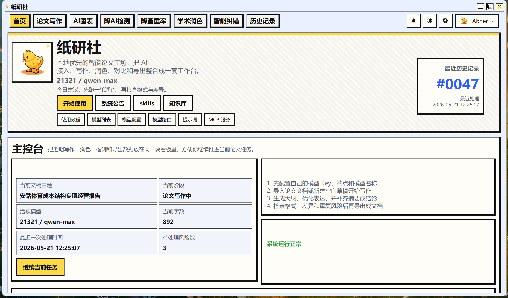
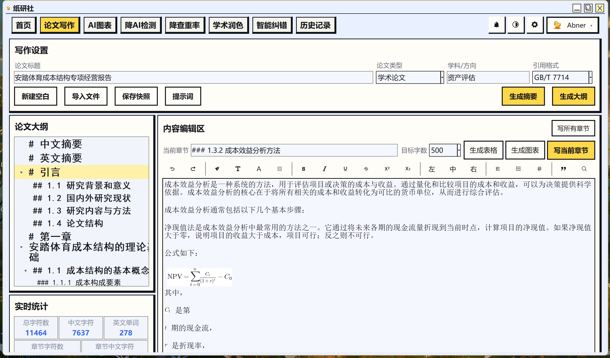
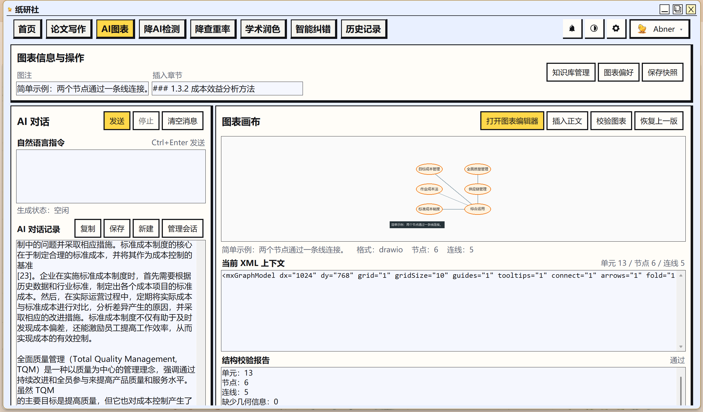
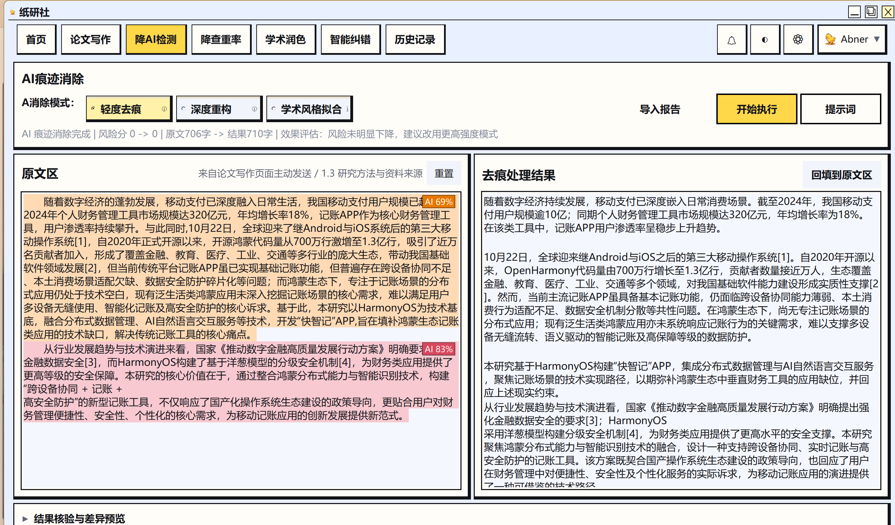
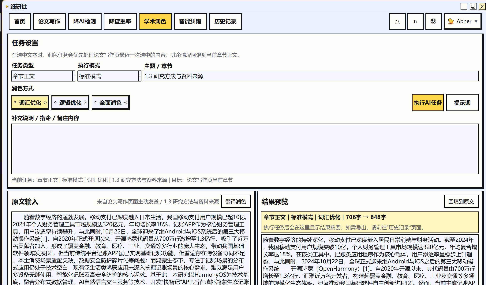
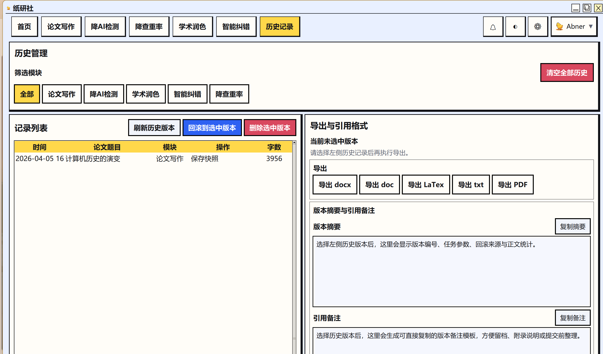

  
  <h1>纸研社</h1>
  
<strong>面向 Windows 的本地优先 AI 智能论文工作台</strong>

  

    搭建一站式学术写作辅助工具平台 · 支持主流 AI 模型 · 离线可用 · 数据不出本地
  

---

## 项目简介

**纸研社**是一款运行在 Windows 平台的桌面应用程序，集论文写作、降 AI 检测、降查重、学术润色、智能纠错五大功能于一体。所有数据保存在本地，API 密钥加密存储，无需注册、无需联网登录，开箱即用。

## 界面预览

  
    
  
    
  
    
  
    
  
    
  

## 功能特性

### 论文写作

- AI 辅助生成大纲，按章节逐步撰写正文
- 自动生成摘要、关键词和参考文献
- 段落优化与改写
- 支持 GB/T 7714、APA、MLA 引用格式
- 内置富文本编辑器（加粗、斜体、下划线、颜色、缩进等）

### 降 AI 检测

- 三种改写力度：微调 / 深度改写 / 学术风格
- 逐段 AI 特征扫描与智能改写
- 支持导入 AIGC 检测报告（DOCX / PDF），按段落标注风险等级并着色显示

### 降查重率

- 三种改写力度：轻度（20-30%）/ 中度（40-50%）/ 深度（60-80%）
- 本地重复片段检测 + AI 改写
- 支持导入查重报告，精准定位重复内容

### 学术润色

- 按文本类型润色：摘要 / 引言 / 正文 / 结论 / 大纲
- 四种润色模式：语法修正 / 词汇提升 / 逻辑优化 / 全面润色
- 四种执行方式，灵活适配不同需求

### 智能纠错

- 8 大纠错类别：基础文字、语法句法、学术格式、引用规范、数据表达、逻辑严谨性、合规风险、AI 写作痕迹
- 三级严重度标注：提示 / 警告 / 错误
- 支持一键自动修复

### 亮点

- **历史记录**：最多保存 200 条操作记录，支持筛选、对比差异和一键回滚
- **Word 导入/导出**：直接导入 .docx 文件编辑，完成后导出
- **LaTeX 转换**：文本与 LaTeX 格式互转
- **自动保存**：编辑状态实时保存，下次启动自动恢复
- **用量统计**：按模型追踪 Token 消耗与费用

## 快速开始

1. 前往 [Releases](../../releases) 页面下载最新版 **纸研社.exe**
2. 双击运行，无需安装任何依赖环境
3. 在「API 配置」页面填入你的 AI 服务商密钥（支持 OpenAI、DeepSeek、通义千问等 20+ 家服务商，也可使用任何兼容 OpenAI 格式的自定义端点）
4. 开始使用

> 系统要求：Windows 7 及以上，32 位 / 64 位均可运行，调用 AI 功能时需要网络连接。

## 温馨提示
拿到软件的第一时间务必按照现有的提示词针对自己的情况进行优化，才能发挥出软件的效果！以下是一些优化建议：
- 网上收集提示词优化的经验和技巧，或者参考一些提示词库，找到适合学术写作的提示词模板。
- 在生成大纲前，尽量提供详细的论文题目、研究领域、核心观点等信息。
- 务必注意AI生成内容的准确性和学术规范，尤其是参考文献的格式和真实性。
- 请勿将 AI 生成的内容直接提交，务必进行人工审核和修改，以确保论文质量和学术诚信。
- 务必不要过度依赖 AI 生成内容，保持自己的学术思考和写作能力。

## 意见与建议

纸研社仍在持续开发中，非常期待听到你的声音！无论是功能建议、使用体验反馈，还是发现了 Bug，都欢迎通过以下方式告诉我：

- **提交 Issue**：在 [Issues](../../issues) 页面描述你的问题或想法
- **邮箱**：1444170707@qq.com
- 每一条建议都会被认真阅读，你的反馈将直接影响后续版本的开发方向。感谢你帮助纸研社变得更好！

## 致谢

名单：

-  小黑盒：Sakirooooo、棉扇、FTEM

## 捐赠支持

如果纸研社对你的学术写作有所帮助，欢迎请作者喝杯咖啡 :)

  <table>
    <tr>
      <td align="center">
         
        <b>微信</b>
      </td>
      <td align="center">
         
        <b>支付宝</b>
      </td>
    </tr>
  </table>

